# Aplicación financiera "Tus Finanzas"
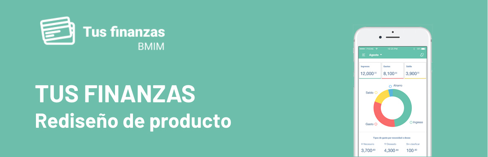

## 1. Objetivos comerciales y especificaciones técnicas
Objetivos iniciales del proyecto
* Realizar evaluación del desempeño y diagnóstico de la aplicación Tus Finanzas
* Redefinir los user personas a quienes se dirige la app
* Optimizar el producto mejorando la experiencia de usuario en donde puedan tener mejor control de sus finanzas a través de un registro de gastos mensuales y fomentar el ahorro a través de metas 
* Incentivar la adquisición de nuevos productos financieros que les ayuden a incrementar su dinero.
* Llegar a un mayor número de cuentahabientes

### Diagnóstico

[Presentación diagnóstico](https://docs.google.com/presentation/d/1EdjIAJmSK149UQKdj643wR-rmzvPXoSl2eJrDbdnz6U/edit?usp=sharing)

Entre los problemas de experiencia dentro de la etapa 1 y 2 del funnel de conversión se detectaron:
* Tráfico poco adecuado al perfil de usuario planteado
* Los ads atraen público pero no son en su mayoría las user personas que se desea
* Elementos de interacción que confunden al usuario
* Diseño visual y jerarquía de algunos elementos
* Poca claridad respecto al SO de los dispositivos móviles

El primer obstáculo al que se enfrenta el usuario y el negocio es en facebook ads que no ofrece mucha información sobre la app o el SO móvil para el que fué desarrollada y no filtran el tráfico de usuarios a la landing page, ya que posiblemente no se hayan segmentado los intereses del público al que se dirigen tomando en cuenta las características técnicas de la app “Tus Finanzas” como el sistema operativo o dispositivos.

El mayor número de visitas provienen de **dispositivos móviles con 11,101,856** usuarios, seguido por **computadoras de escritorio con 3,774,631** y por último **tablets con 70,410** usuarios.

Gracias a los recursos invertidos en facebook ads para generar tráfico hacia la landing page, se obtuvo un número de **visitas de entre el 1.82 % y el 4.48 %** respecto al total de impresiones mensuales, pero la conversión no se lleva a cabo ya que el mayor número de visitas son de usuarios Android. Cabe destacar que este grupo de   usuarios sí se interesan por la app “Tus Finanzas” pero al no indicar en ninguna parte del landing page que la app es sólo para iOS, se quedan en esta etapa del embudo ya que la aplicación no está desarrollada para este SO móvil y no pueden continuar el proceso de descarga. 

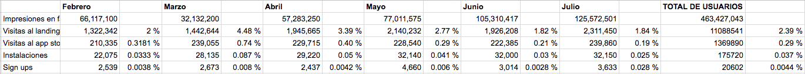

Respecto a los usuarios que sí cuentan con iOS se puede observar que pasan mayor tiempo dentro del landing page a diferencia de los usuarios android pues al ser una app desarrollada para ellos muestran mayor interés y ven más detenidamente la información que ahí se proporciona sobre la app.

* 9,866,962 Android
* 806040 iOS
* 428,854 Otros

Durante el testing del prototipo, algunos usuarios indicaron que les parecía confuso el hecho de que en los botones el CTA dijera “Descárgala ahora” y al dar clic los desplace a un formulario en el que entendían que al registrar sus datos recibirían un correo con el link de descarga, sin embargo esto no sucedía y sólo recibían un mensaje de agradecimiento que los dirigía finalmente al App Store.

### Evaluación del desempeño del landig page y la aplicación 

#### Análisis de app en el AppStore antes de instalar

La App tiene un rating muy bajo 2.64
Es la número 7 en finanzas, pero no indica si en latinoamérica como lo dice en la landing page
La edad que muestra es para 9+, aunque en realidad es una app para adultos lo que haría pensar que puede ser para niños

#### Análisis de app ya instalada

La primer pantalla muestra un icono como de partenón con una frase que dice,” el banco contigo a donde vayas”, sin embargo no es propiamente la aplicación del banco, sino una aplicación financiera para control de gastos y metas de ahorro, es decir, no ofrece todas las funcionalidades de una App bancaria que permita tener el acceso al banco desde donde estés

##### Proceso regístrate

La pantalla inicial 1/5 de registro muestra el icono de una persona del sexo masculino con corbata en tonos grises y verdes
Al registrarse solicita número de cuenta y número de celular, se llenan los campos y el botón continuar se activa
pantalla 2/5 inmediatamente se muestra una viso en el que indican que han enviado un código por SMS para completar el registro
Se pone el código recibido y el botón de continuar se activa
pantalla 3/5 solicita el correo electrónico y la contraseña
una vez llenados estos dos campos se activa el botón continuar
Pantalla 4/5 muestra un ícono de una persona vestida casual con un signo de + que indica que agregue una fotografía de perfil  y un texto de hacerlo más tarde
pantalla 5/5 si se dá clic en “hacerlo más tarde” muestra una pantalla que dice “Toca para registrar tu huella” pero no indica en dónde debe tocar exactamente
Si se da clic en el texto toca para registrar 

#### OBSERVACIONES
La aplicación sólo puede ser utilizada por cuentahabientes del banco y no por público en general pero nunca se indica

##### Proceso inicia sesión

Si un usuario ya se ha registrado previamente puede dar clic en Iniciar sesión que lo llevará a una pantalla que le indica poner su huella en el botón home para iniciar. Una vez colocada la huella el sistema la reconoce  envía un mensaje de huella verificada acceso confirmado y envía a la pantalla inicial.

#### OBSERVACIONES
A pesar que en el registro se pidió un correo electrónico y contraseña, en el   momento de iniciar sesión solo permite el inicio con huella, así que no permite otra alternativa al usuario y se convierte en un dato que se requirió inicialmente y nunca se vuelve a usar.

#### 1.Inicio en la App

Pantalla de bienvenida app muestra nombre de usuario y  cuenta vinculada con el saldo disponible
el menú principal se encuentra desplegado, se conforma por Movimientos, Ahorros y Gastos
Muestra 2 iconos en la parte superior, izq menú hamburguesa con el perfil del usuario que despliega nombre y fecha y hora de última conexión, lado derecho icono de alertas pero no está activo

#### 2.Movimientos 

La transición entre pantalla es rápida aunque es poco común ya que parece que se va a minimizar pero sólo cambia de tamaño y se desliza de derecha a izquierda para avanzar, para ir atrás se desliza en sentido contrario
A pesar de que es la sección de movimientos no hay un título que muestre al usuario en qué sección está
En la sección Movimientos muestra un primer módulo en verde que abarca una tercera parte de la pantalla con título de Saldo Disponible y un pequeño icono de buscador al lado superior derecho que no tiene función activada
Ubicado del lado superior izquierdo se encuentra el botón para regresar a la pantalla anterior junto al título
Para poder ver los movimientos existe un input de lista de selección que permite mostrar los movimientos por mes organizados de más recientes a anteriores
Despliega un listado de movimientos con tìtulo y fecha de operación marcando en rojo y con símbolo negativo los gastos y en verde y símbolo positivo los ingresos mostrando primero los movimientos más recientes
En el prototipo el menú circular no se mantiene fijo en esta pantalla y se desliza al momento de dar scroll a la lista

##### 2.1 Detalle de movimiento ingresos
La transición es simple cambio de pantalla sin ningún tipo de efecto
Muestra un módulo principal al igual que la sección anterior en verde, contiene el título detalle operaciones, el nombre del movimiento yingreso  el monto epositn positivo. ocupa alrededor de una cuarta parte de la pantalla
ubicado del lado superior izquierdo se encuentra el botón para regresar a la pantalla anterior 
La información de detalle del movimiento tiene subtítulos en inglés y español “Given Operation” con fecha y hora del movimiento y “Descripción” que muestra que el pago se realizó con tarjeta de débito (número de tarjeta #5642 que supongo es ta terminación) el nombre del establecimiento y ubicación registrada
Al final muestra nuevamente el menú que al dar clic muestra las opciones de Movimientos, Ahorros y Gastos 
Desaparece el icono de buscar
##### 2.2 Detalle de movimiento  gastos
Muestra un módulo principal al igual que la sección anterior pero esta vez en fondo rojo porque es un gasto, contiene el título detalle operaciones, el nombre del gasto y el monto en negativo. ocupa alrededor de una cuarta parte de la pantalla
La información de detalle del movimiento tiene subtítulos en inglés y español “Given Operation” con fecha y hora del movimiento y “Descripción” que muestra que el pago se realizó con tarjeta de débito (número de tarjeta #5642 que supongo es ta terminación) el nombre del establecimiento y ubicación registrada
Al final muestra nuevamente el menú que al dar clic muestra las opciones de Movimientos, Ahorros y Gastos 
Desaparece el icono de buscar

#### 3. Ahorros

Muestra un módulo que cubre el 30% de la pantalla contiene el botón para regresar, el título Ahorros y el ícono de búsqueda

El listado de ahorros es muy simple y permite visualizar el nombre de la meta, el monto y el porcentaje de avance sin embargo el botón para crear una nueva meta de ahorro parece no pertenecer a ningún menú y estar flotando libremente, el texto que acompaña este botón no se relaciona con la creación de meta de ahorro. Una vez que el usuario da clic en ese botón se percata de que es para crear una meta de ahorro  a través de un formulario breve y puntual con el nombre de la meta, el monto y la fecha, automáticamente el sistema divide el monto total entre el lapso de tiempo y asigna el monto que se sumará semana tras semana.

#### 4. Gastos

Esta sección muestra una consistencia en cuanto al despliegue de la información, utilizando un fondo rojo que hace clara referencia a gastos muestra todos los gastos clasificados por categorías y la suma total de cada categoría lo que permite ver de una manera más sencilla en qué categorías gastas más permitiendo al usuario tomar medidas al respecto, sin embargo no permite crear nuevas categorías.

## Plan de descubrimiento

**ME GUSTARÍA SABER MÁS DE:**
1. Buscar información estadísticas de inegi para ahorrar pasos para indagar rango de edad
2. Ver por qué en estados unidos y europa están haciendo ese tipo de aplicación y porque la quisieron traer a México
3. Por qué la gente en México querría ahorrar si no hay una cultura de ahorro
4. ¿Cuáles son las principales problemáticas de ahorrar en México?
5. Cuáles son los principales motivos de tener un control de gastos
6. ¿Cuáles son las cosas que motivan a la gente a ahorrar?
7. Identificar quienes son los que están ahorrando y para que metas están ahorrando
8. Implementar gasto hormiga para identificar en qué se te va el dinero

###  RECOPILACIÓN DE INFORMACIÓN Y  ESTADÍSTICAS

**INFORMACIÓN**
* Cómo ahorramos los mexicanos [ver Link](https://www.condusef.gob.mx/Revista/index.php/ahorro/ahorro/168-como-ahorramos-los-mexicanos)
* ¡12 tips para que ahora SÍ ahorres! [ver Link](https://www.marthadebayle.com/v3/radiov3/sosv3/12-tips-para-que-ahora-si-ahorres/)
* ¿Quiénes ahorran más, los hombres o las mujeres? [ver Link](https://www.debate.com.mx/ahora/Quienes-ahorran-mas-los-hombres-o-las-mujeres-20171206-0175.html)
* TIPOS DE AHORRADORES [ver Link](http://amp.milenio.com/negocios/finanzas-personales/que-tipo-de-ahorrador-eres)
* En México el ahorro es informal [ver Link](http://www.elfinanciero.com.mx/economia/en-mexico-el-ahorro-es-informal)

**ESTADÍSTICAS**
* Encuesta Nacional sobre uso de internet y smartphone [ver Link](http://www.beta.inegi.org.mx/contenidos/saladeprensa/boletines/2018/OtrTemEcon/ENDUTIH2018_02.pdf)
* LOS MEXICANOS Y EL AHORRO [ver Link](http://consulta.mx/index.php/estudios-e-investigaciones/mexico-opina/item/954-los-mexicanos-y-el-ahorro)

**Insights de investigación y estadísticas**

* Los mexicanos ahorran de manera informal (tandas, debajo del colchón), lo hacemos pensando en el corto plazo.
* El ahorro es a corto plazo, para cubrir emergencias o metas personales inmediatas.
* No pensamos en el futuro, no planeamos el futuro.
* Más del 50% de la población no tienen cuentas bancarias, por lo tanto no puede acceder a opciones formales para hacer que su dinero crezca de manera segura.
* De los usuarios de celular inteligente, 36.4 millones instalaron aplicaciones en sus teléfonos: el 92.1% instaló mensajería instantánea, el 79.8% herramientas para acceso a redes sociales, el 69.7% instaló aplicaciones de contenidos de audio y video, mientras que 16.0% utilizaron su dispositivo para instalar alguna aplicación de acceso a la banca móvil.
* 4 de cada 10 mexicanos ahorra para cumplir alguna meta
* Carecemos de autocontrol.
* Para poder generar ahorro es indispensable saber en qué estoy gastando; de esta manera siempre llevaré un control de la relación ingreso – egreso.
* la distribución exacta de todos y cada uno de nuestros compromisos financieros nos permitirá controlar perfectamente en qué, cuánto y cómo gastamos. Eso es el Patrón de Consumo.
* La mayor parte de los mexicanos no tienen una cultura financiera.
* Cuando tenemos objetivos financieros dejar de gastar en cosas pequeñas será muy fácil si eso implica que alcanzaré mis sueños.
* El 90.7 por ciento de los hombres y el 88.2 por ciento de las mujeres dijo estar preparado en caso de que surja algún imprevisto y se requiera dinero.
* La investigación muestra el acceso que tienen los hombres y las mujeres a productos y servicios financieros, donde se demuestra que existe aún una brecha de género entre hombres y mujeres.
* En el hábito del ahorro, siete de cada diez personas expusieron que aprendieron a ahorrar cuando eran menores de edad.
* La falta de dinero sobrante es claramente mayor entre los ciudadanos de clase baja donde 47% así lo manifiesta, a diferencia del 17% de nivel alto que lo mencionó.
* Entre 2004 y 2017 baja la costumbre de guardar dinero en efectivo en casa y de participar en tandas, apareciendo de manera importante el ahorro en cajas de ahorro.
* Los ciudadanos de clase baja apenas muestran en 8% de bancarización de sus ahorros, pero ese porcentaje aún es menor en zonas rurales con apenas 5%.
* Las tandas tienen su mayor penetración en el nivel económico medio, y como se vio antes este segmento tiene una bancarización de ahorro de solo 20%, es decir, la clase media prefiere en promedio participar en tandas que ahorrar en bancos (igual pasa en la clase baja).
* A pesar de que el valor del dólar es un indicador de la economía y seguido por los medios, la compra de esa moneda es realizada regularmente por solo el 3% de la población nacional, y quienes lo hacen están concentrados en el norte del país y los ciudadanos de nivel económico alto.
* Existen tres tipos generales de ahorradores. Encuentra con cuál te identificas más y sigue la recomendación para saber si puedes seguir adelante con los grandes proyectos que traes en mente, desde viajar hasta empezar a construir tu patrimonio.

### HIPÓTESIS

**1. Yo creo que la app tus finanzas necesita integrar una nueva sección de presupuesto  que ayude a los usuarios actuales y nuevos a llevar un mejor control de sus finanzas personales**

**VALIDACIÓN DE HIPÓTESIS** Voy a validarlo a través de investigar qué es lo que se necesita para mejorar las finanzas personales a través de contenidos e internet y lo que hacen los usuarios que logran hacer una mejora en sus finanzas

**2. Yo creo que para registrarse en la app tus finanzas como cliente necesita tener un numero telefónico registrado en el banco previamente con su app móvil, esto facilitaría distinguir entre usuarios que ya son clientes**

**VALIDACIÓN DE HIPÓTESIS** Voy a validarlo a través de investigar qué es lo que normalmente piden las apps móviles de los bancos

**3. Yo creo que los user personas de la app tus finanzas que nos proporcionaron no son los correctos**

**VALIDACIÓN DE HIPÓTESIS** Voy a validarlo/refutarlo a través de realizar pruebas de testing con usuarios y entrevistas para conocer sus intereses y motivaciones, además de investigar en estudios y estádísticas previas

## 2. Informe de análisis competitivo

[Presentación soluciones](https://docs.google.com/presentation/d/15Jk12SpSEET5nxCrUHETG8jvvqPtr_ZwmY_dPs3VFe8/edit?usp=sharing)

### Competidores relacionados 
#### Benchmark
[ver Link](https://docs.google.com/spreadsheets/d/1LTpDwX2iVHxB_ZMufXM5n4Rd8qZYUyqSg7xSs7XdOXQ/edit?usp=sharing)
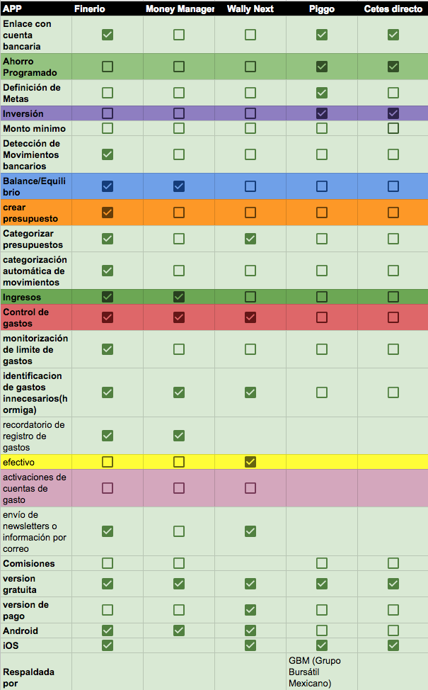

#### Ideación
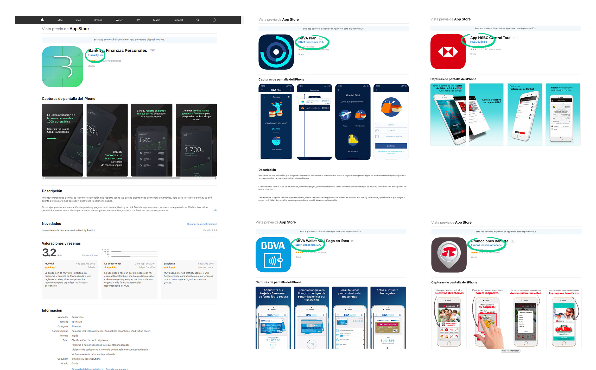

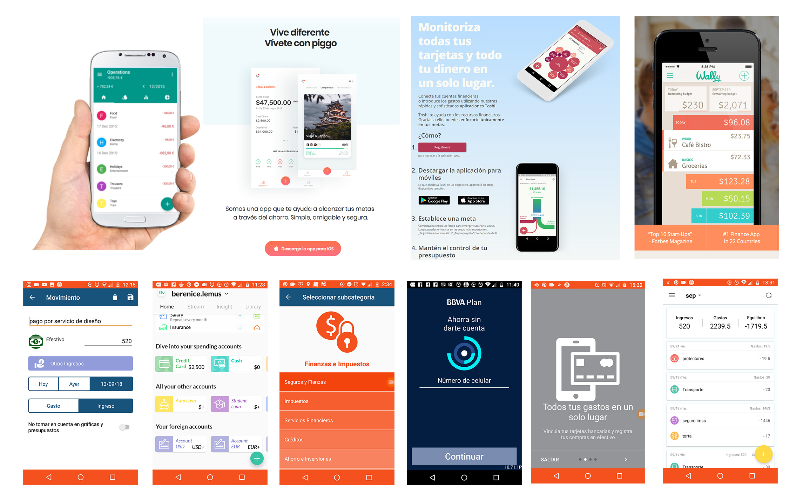
 

# Propuesta de optimización del producto

## 3. Redefinición de user personas

* Guía de preguntas para entrevistas [ver Link](https://docs.google.com/document/d/1Gu6VnkOS6rNsgnR3_tq5LKxHzQl4642_s5E_IaQq-2A/edit?usp=sharing)
* Pruebas de usabilidad [ver Link](https://www.useloom.com/share/0bc8f0511c9a462e948a8688bcd2f9f7)

### Entrevistas Insights

* Estoy ahorrando por varios medios para una meta de largo plazo (Una casa) de 3 a 5 años
* Algunos ahorros son formales (caja de ahorro de la empresa, banco) y otros informales (tanda)
* Voy juntando el 10% de mi sueldo distribuido en distintos medios
* La mayor parte de las metas de ahorro son a corto plazo
* Destino un porcentaje del 5% de lo que gano para cubrir gustos y antojos
* Llevo un presupuesto quinceñal para la renta, mantenimiento, pasajes, comida, ahorro
* Llevo un registro diario para ver en lo que estoy gastando y eso me permite ver en qué estoy gastando y cuanto debo destinar para ciertos gastos
* llevaba en el celular un block de notas con los gastos y lo pasaba a excel
* El registro me permite detectar el gasto hormiga y aunque tengo un porcentaje para eso a veces se me iba y no me daba cuenta
* los fondos de ahorro me dan un interés, las tandas no me dan un extra pero puedo destinar ese ahorro para un gasto pequeño
* Trato de ser muy buena administradora porque no puedo darme el lujo de tener fugas de dinero
* Trato de tener un guardadito para darme ciertos gustos a fin de quincena
* Como metas a largo plazo no las logro cumplir pero a corto plazo sí
* Al comprar el sentimiento es de gusto pero considerando algo que pueda pagar
* No tengo un presupuesto destinado para una emergencia
* He intentado juntar los tickets de mis compras pero nunca logro registrar mis gastos por falta de disciplina
* Para mí es dificil llevar el control del efectivo porque se me va sin saber en qué
* Sería hacerte consiente darte cuenta de tus hábitos de consumo
* Ahorro para estar con mi pareja
* Siempre me quedaba sin dinero a fin de quincena, por eso empecé a cuidar mi dinero
* Un amigo me dijo que hay una aplicación que te hace ahorrar, es mi favorita
* Yo haría mi ahorro quincenal o mensual, si es semanal es probable que yo ya no tenga dinero
* En mi app bancaria puedes hacer un apartado para ahorros, te hace un cálculo, un plan y te hace tus finanzas, cuánto quieres y para qué quieres y si tu quieres puedes retirar el dinero
* Me costó mucho trabajo activar mi app bancaria y tuve que ir a sucursa pero es muy sencilla utilizarla
* Mi app hace un balance de lo que ingresas y gastas
* Mi app bancaria la puedo abrir con mi huella digital, en otras apps que he usado ingresas con tu usuario y te muestra una imagen y tu nombre e ingresas con contraseña
* Mi app muestra los movimiebtos por fecha y por tarjeta

Persona Comportamiento, FRUSTRACIONES Y NECESIDADES
DEL USUARIO, POTENCIALES SOLUCIONES

## 4. Arquitectura de la información

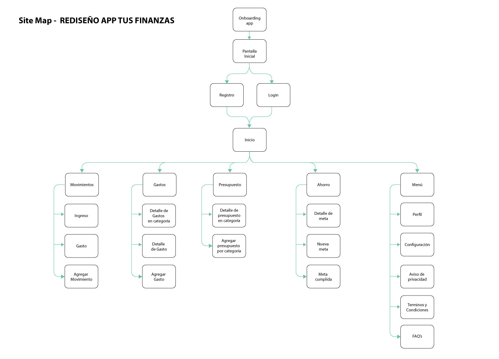

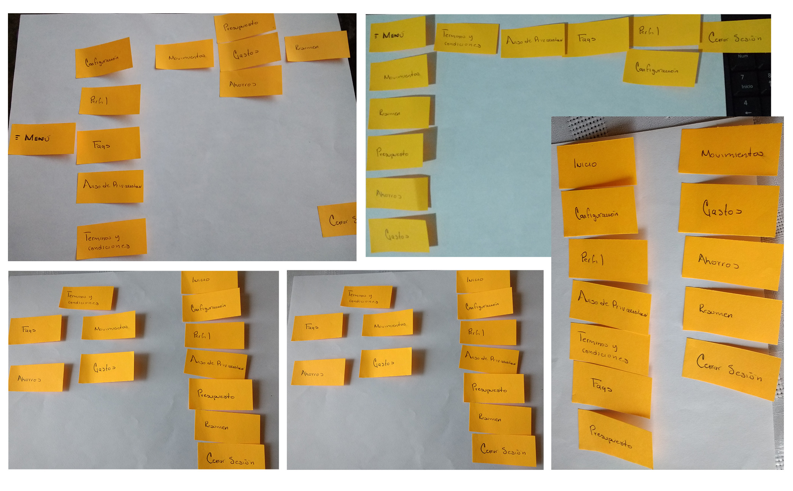

 
## 5. Mapas de experiencia y flujos de usuarios

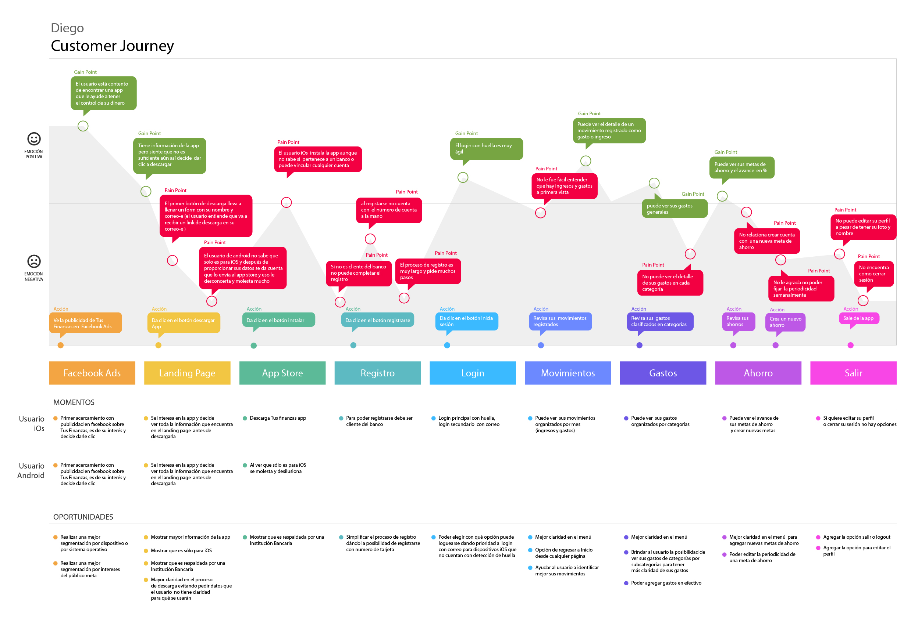

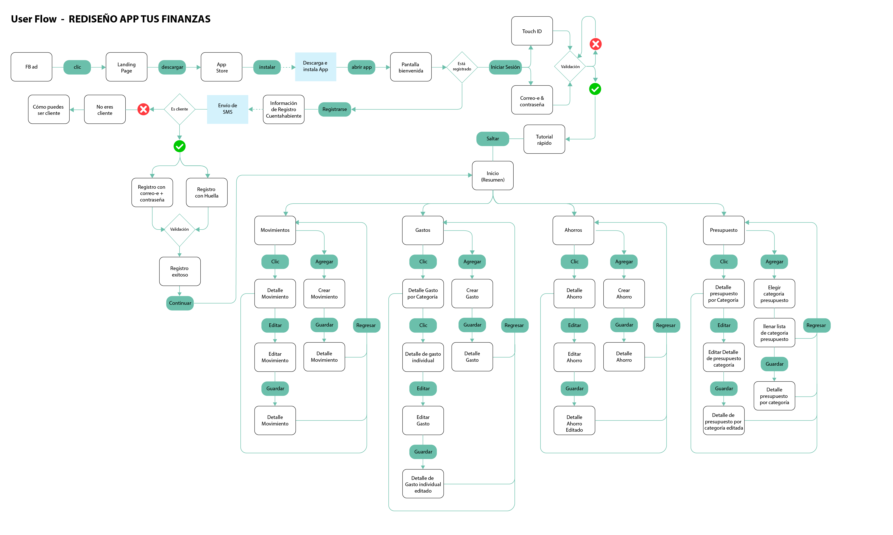

## 6. UX Wireframes

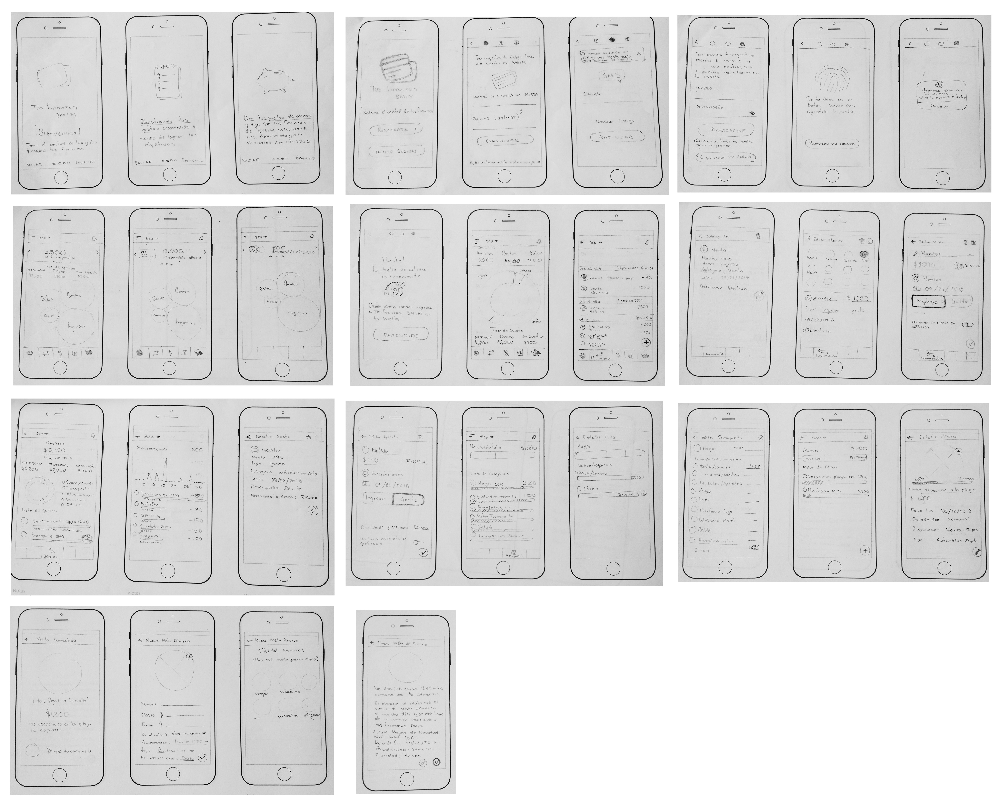

## 7. Prototipos interactivos

https://marvelapp.com/5igehb5

## 8. Diseño visual

[Presentación Implementación](https://docs.google.com/presentation/d/1OdNk1RsB-MBuvHc30mfXdeXWqLl9oMv26FKrXguSlek/edit?usp=sharing)

#### Landing Page
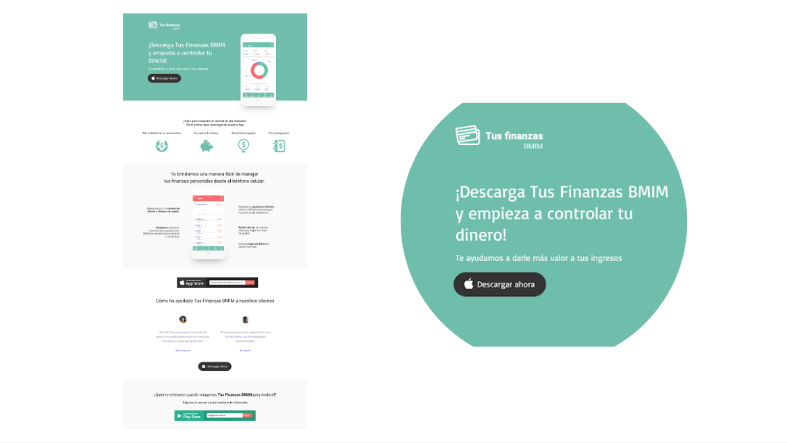

#### Registro
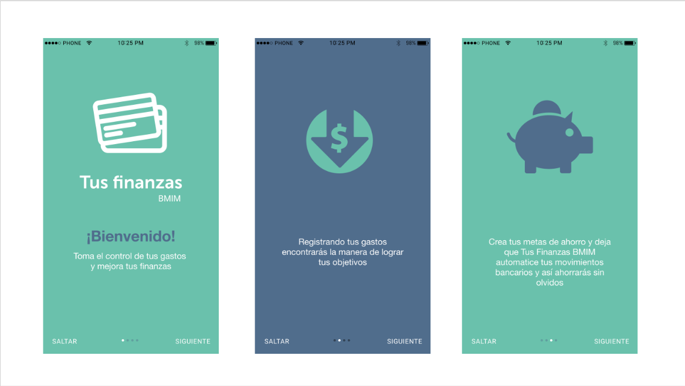

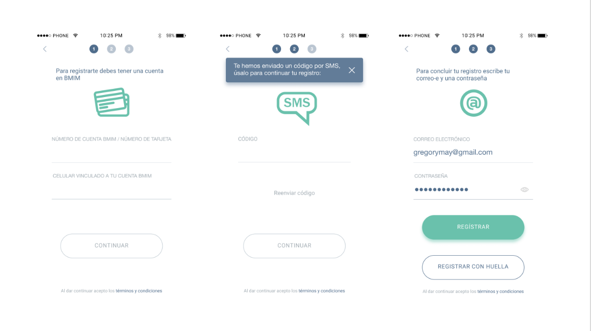

#### Presupuesto
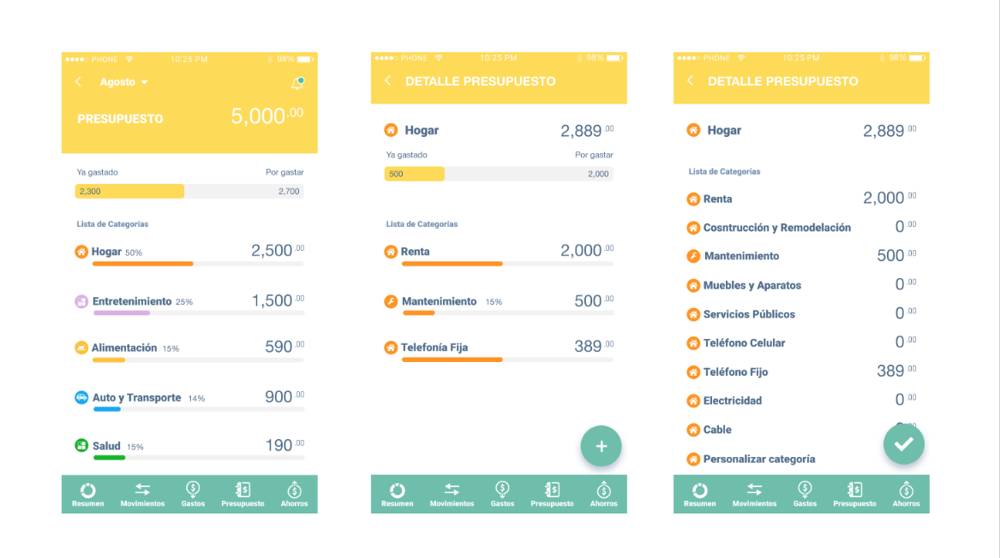

#### Movimientos
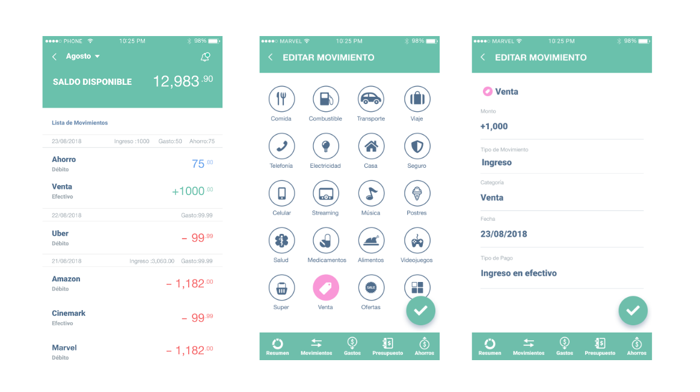

#### Gastos
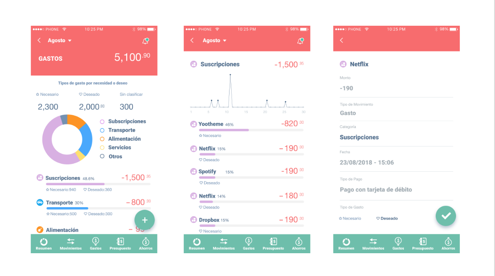

#### Ahorro
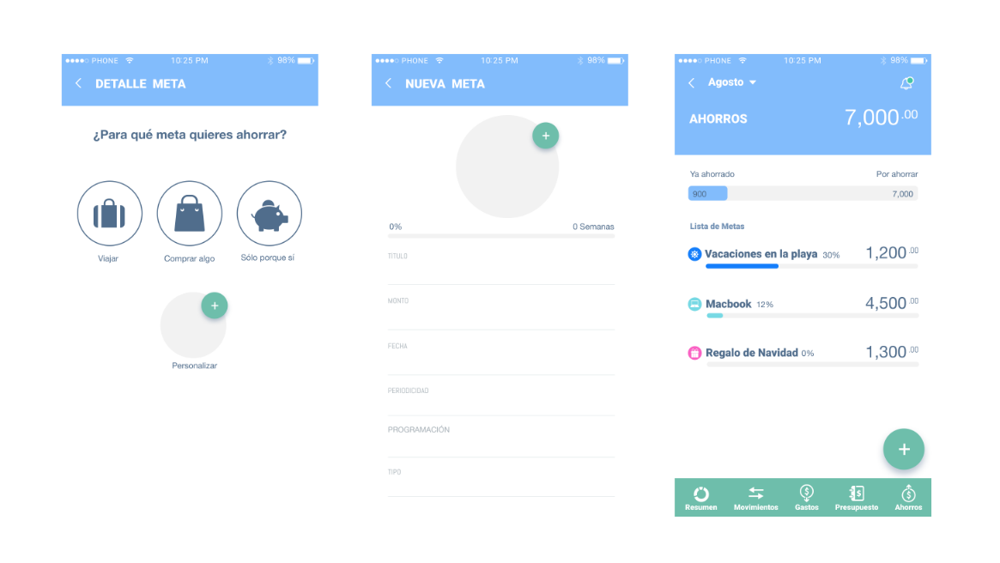

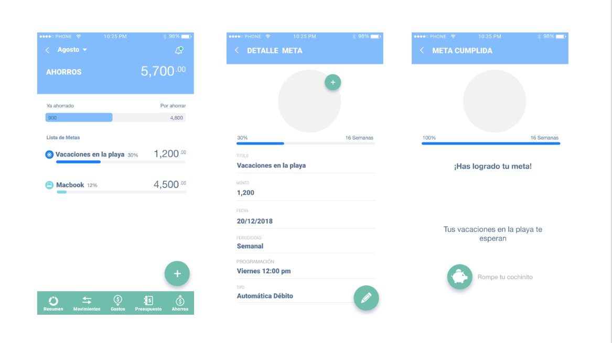

#### Registro

verdes y azules

El verde es el color del crecimiento, de la renovación y el renacimiento.
Favorece la resolución de problemas, así como la libertad, la sanación y la tranquilidad.
El verde opaco representa el dinero, a lo económico y a la burguesía
Es el color azul es el más usado en las empresas por ser productivo y no invasivo.
Es un color que sugiere sensación de seguridad y confianza en una marca.

## 9. Guía de estilo y especificaciones para desarrolladores

## 10. Pruebas de usabilidad e informes de análisis de uso

